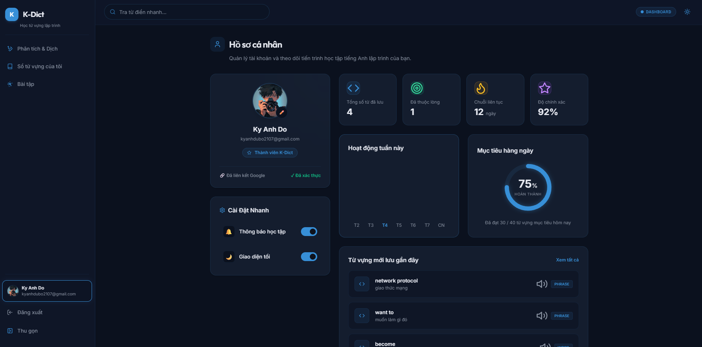

# K-Dict

K-Dict là ứng dụng học từ vựng tiếng Anh lập trình. Ứng dụng hỗ trợ phân tích text tiếng Anh bằng Gemini AI, dịch nhanh sang tiếng Việt, trích xuất từ/cụm từ/câu đáng học, lưu vào sổ từ vựng cá nhân và luyện tập lại qua các màn hình bài tập.

## Demo




## Tính năng

- Google Login qua frontend và backend `/auth/google`.
- JWT lưu ở client và tự gắn vào các request cần đăng nhập.
- Analyze text bằng Gemini AI, có retry ngắn để giảm lỗi provider tạm thời.
- CRUD vocabulary theo từng user bằng `user_id`.
- Tìm kiếm, lọc loại từ và phân trang sổ từ vựng.
- Trang Profile hiển thị thông tin Google, thống kê học tập và từ mới lưu.
- Trang Exercises gồm quiz, flashcard, luyện code và danh sách từ hay quên.
- Giao diện React/Vite, TailwindCSS, dark theme và sidebar thu gọn.

## Công nghệ

| Tầng | Công nghệ |
| --- | --- |
| Backend | FastAPI, SQLAlchemy, Pydantic |
| Auth | Google OAuth ID token, JWT |
| AI | Gemini qua `google-genai` |
| Database | SQLite local |
| Frontend | React + Vite |
| Styling | TailwindCSS + shadcn/ui primitives |

## Cấu trúc dự án

```txt
K-Dict/
+-- api/
|   +-- app/
|   |   +-- core/
|   |   +-- models/
|   |   +-- routers/
|   |   +-- services/
|   |   +-- database.py
|   |   +-- main.py
|   |   +-- schemas.py
|   +-- data/
|   +-- scripts/
|   +-- requirements.txt
+-- client/
|   +-- public/
|   +-- src/
|   |   +-- api/
|   |   +-- components/
|   |   +-- hooks/
|   |   +-- layouts/
|   |   +-- pages/
|   |   +-- App.jsx
|   |   +-- main.jsx
+-- docs/
|   +-- API.md
|   +-- ROADMAP.md
|   +-- structure.md
+-- README.md
```

## Chạy backend local

```bash
cd api
python -m venv .venv
.venv\Scripts\activate
pip install -r requirements.txt
uvicorn app.main:app --reload
```

Backend chạy tại `http://127.0.0.1:8000`.

Biến môi trường cần có trong `api/.env`:

```txt
AI_API_KEY=your_gemini_api_key
AI_MODEL=gemini-3-flash-preview
AI_DEFAULT_TAG=programmer
GOOGLE_CLIENT_ID=your_google_client_id
JWT_SECRET_KEY=your_jwt_secret
JWT_ALGORITHM=HS256
JWT_EXPIRE_MINUTES=1440
```

## Chạy frontend local

```bash
cd client
npm install
npm run dev
```

Frontend chạy tại `http://localhost:5173`.

Biến môi trường cần có trong `client/.env`:

```txt
VITE_GOOGLE_CLIENT_ID=your_google_client_id
```

## Tài liệu

- [Cấu trúc dự án](docs/structure.md)
- [Tài liệu API](docs/API.md)
- [Roadmap và ghi chú review](docs/ROADMAP.md)
